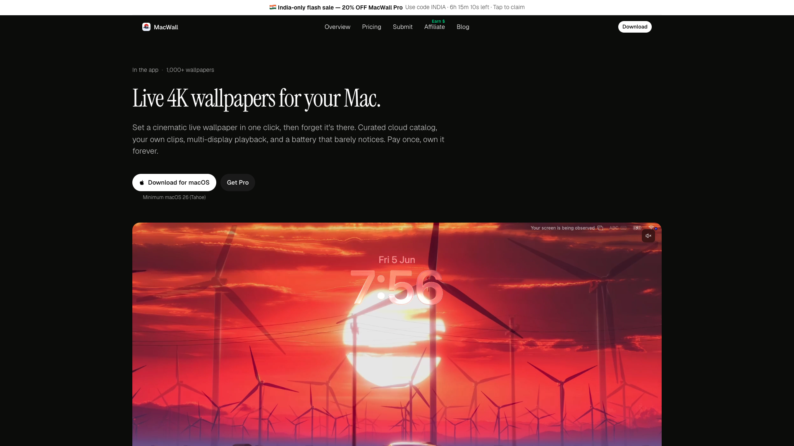
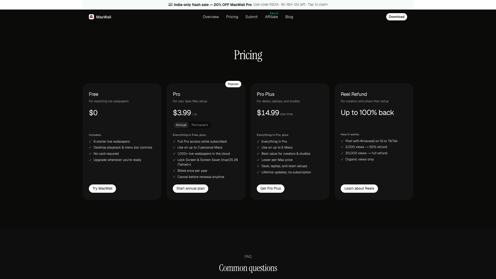
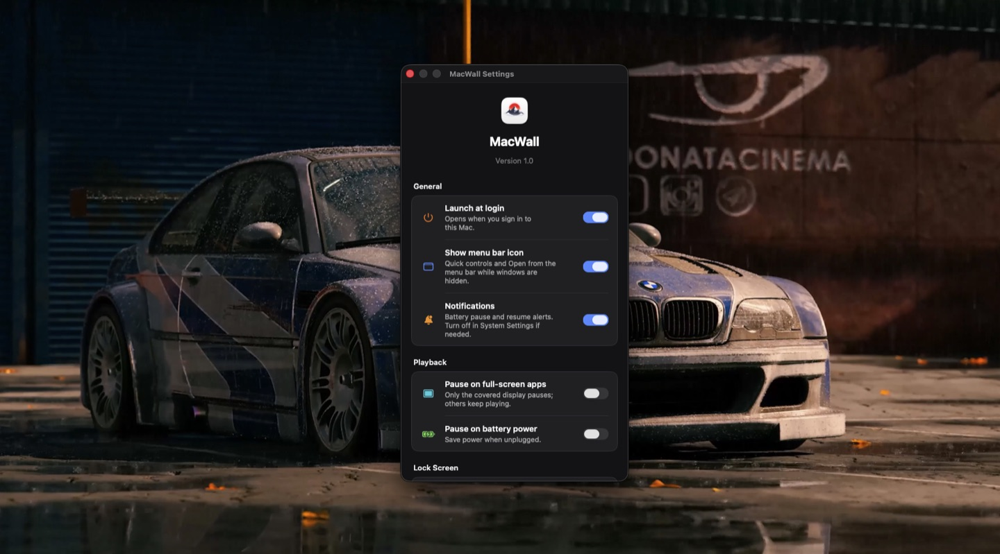

# MacWall Web

Marketing site and web platform for **[MacWall](https://macwall.app)** — a native macOS app for cinematic live 4K wallpapers.

**Live site:** [https://macwall.app](https://macwall.app)

Browse the catalog, download the Mac app, and unlock Pro with Stripe Checkout. After payment, the license opens the app via `macwall://activate`.

You do not need this repo to use MacWall — clone it only if you want to run or contribute to the web stack.



## What this repo does

- Homepage and marketing pages
- Pricing (Free · Pro · Pro+)
- Stripe Checkout and license activation flow
- Blog and SEO landing pages
- Community wallpaper submissions
- Affiliate program pages
- Support inbox UI

The native Mac app is Swift and lives in a separate repository.

## Screenshots

### Homepage


### Pricing



### App settings



## Tech stack

| Piece | Purpose |
| --- | --- |
| Next.js (App Router) | Site and API routes |
| React + TypeScript | UI |
| Stripe | Checkout |
| Supabase | Licenses and backend data |
| Vercel | Hosting |
| Tailwind CSS + shadcn/ui | Styling |
| Cloudflare R2 | Wallpaper media CDN |

## Local development

```sh
git clone https://github.com/foundrceo/MacWall-Web.git
cd MacWall-Web
npm install
cp .env.example .env
npm run dev
```

Copy `.env.example` to `.env` and fill in values from your deployment secrets store (Vercel project settings). **Never commit `.env` or real credentials.**

Marketing pages can run with a partial env setup; checkout and license flows require Stripe and Supabase configuration. See `.env.example` for variable names only.

```sh
npm run lint
npm run typecheck
npm run build
```

Open [http://localhost:3000](http://localhost:3000).

## Useful routes

| Route | Description |
| --- | --- |
| `/` | Homepage |
| `/pricing` | Plans |
| `/download` | Mac installer |
| `/blog` | Blog |
| `/submit` | Community wallpapers |
| `/affiliate` | Affiliate program |
| `/support` | Support |

## Download the Mac app

**[https://macwall.app/download](https://macwall.app/download)**

## License

Proprietary — see [LICENSE](./LICENSE).
